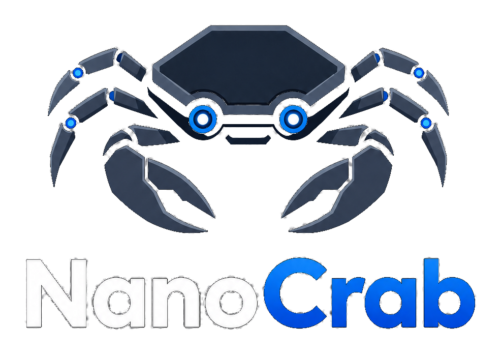

# NanoCrab

<p align="center">
  
</p>

> Standalone personal AI assistant platform with multi-channel messaging, an admin dashboard, provider-neutral agent skills, autonomous coding agents, memory, journal, and plugin support.

**NanoCrab 2.0-RC8**

---

## What Is NanoCrab?

NanoCrab is a standalone personal assistant platform for running AI agents in isolated containers. It combines messaging channels, a web dashboard, provider routing, autonomous coding, long-term memory, journal/event tracking, and provider-neutral skills in one understandable Node.js process.

NanoCrab is its own product now. It is not an upstream-compatible fork of any upstream project. NanoCrab 2.0-RC8 uses NanoCrab-native container images, MCP names, config paths, cookies, logs, and service identifiers.

For a current route-by-route capability matrix, see [docs/CAPABILITIES.md](docs/CAPABILITIES.md).

## Learning, Memory, And Skills

NanoCrab 2.0-RC8 is a major step toward a long-running personal agent. It can learn over time, keep memories, reuse those memories across channels, and grow its own provider-neutral skills, but it does this with review and provenance instead of silently absorbing everything it sees.

RC3 focuses on making the new workspace surfaces easier to operate: the dashboard now separates pure chat, project collaboration, and repository work while still exposing guided coding assignment, GitHub issue pickup, Autofix auto-pickup, Cowork projects, routine blueprints, scheduled task delivery controls, webhook approvals, and clearer operator documentation.

- **Structured memory** is stored as reviewed records with scope, type, content, source, confidence, sensitivity, visibility, stale-review state, and contradiction metadata.
- **Shared context** is generated from approved memories into runtime `MEMORY.md` files, so chat, automations, coding jobs, journal extraction, and reports can all benefit from the same remembered facts and preferences.
- **Provider-neutral skills** live as `SKILL.md` packages. Agents can propose new skills, validate them, show a diff in the dashboard, and request approval before installation into `container/skills`.
- **Skill suggestions** appear in the dashboard when recent conversation history looks like a reusable workflow. The agent is also instructed to ask whether it should make a skill when the user repeats a task or gives durable operating instructions.
- **Skill Registry v1** tracks enabled state, scope, visibility, trigger hints, examples, and risk level for every skill. New agent containers receive only the active skills for their group, and the runtime injects the most relevant registry slice for each request.
- **Cross-channel continuity** means a useful approved memory or installed skill is no longer trapped inside one WhatsApp, Signal, Telegram, or dashboard conversation.
- **Safety by default** means memories, skills, report delivery, PR creation, publishing, uploads, external messages, and provider fallback for write-capable work all pass through explicit approval surfaces.

In short: yes, NanoCrab now has governed long-term learning. It remembers what you approve, keeps source/provenance data, and avoids turning casual chat into permanent truth without review.

## Features

### Messaging Channels

- **WhatsApp** — via Baileys (QR code auth)
- **Telegram** — via Grammy bot framework
- **Signal** — via signal-cli native daemon

### Admin Dashboard

Full web dashboard at your domain with 7-layer security (firewall, TLS, IP allowlist, rate limiting, CSP headers, session auth, audit logging).

The dashboard is **mode-first**: the sidebar leads with three top-level focus modes — **Copilot**, **Cowork**, and **Code** — and operational/admin surfaces live in a secondary **More** drawer. Switching mode swaps the mode-scoped sidebar:

- **Copilot** — ChatGPT-style plain conversations. Start a new chat by choosing a provider/model and optional title; there is no agent template or project workspace. If no title is supplied, NanoCrab can name the thread after the first user message.
- **Cowork** — Projects, agents, tasks, workflows, approvals, reports, artifacts, documents, source ledgers, and MCP-backed collaboration. Cowork projects are virtual folders with files, artifacts, documents, chats, previous thread history, project instructions, provider/model selection, a curated context notebook with included/excluded/pinned source items, active skills/plugins/connectors readiness, reusable run estimates, action workflow previews, research-job ledgers, and approved MCP server access for source-backed work such as email summaries or document drafts.
- **Code** — Git & Code, Terminal/Developer Hub, Autofix, and GitHub Copilot. Use this mode for repositories, issues, PRs, tests, review rules, snippets, and coding-agent handoffs.
- **More** — Dashboard, Channels, Messages, Deploy, Monitoring, Containers, Integrations, Webhooks, Credentials, Security, Audit, Uptime, Backup, Usage, Groups, Sessions, Marketplace, Help, and personal setup surfaces.

Memory and Skills are intentionally not buried in Cowork. They live in the personal/shared tooling area because durable memories, learned preferences, reusable skills, assistant identity, provider profiles, credentials, and access controls can affect Copilot, Cowork, Code, scheduled tasks, and channel agents. The app reopens whichever focus mode you used last, migrates the previous `work` saved mode to `cowork`, and existing `#/<page>` deep links keep working by selecting the mode that owns the route. On mobile the bottom bar is Copilot / Cowork / Code / More.

Channel agents use the same workspace map. From WhatsApp, Signal, Telegram, Slack, Discord, or another registered channel, prompts such as "check Cowork for project Aurora Docs, update the summary, and send me the file" can resolve Cowork projects, read or write project files, and send the selected project file back through the current channel when that adapter supports file delivery.

- **Dashboard** — live stats, weather, channel status, message feed, cockpit, smart refresh, and workspace route guidance
- **Copilot chat** — pure web conversations with thread history, provider/model selection, optional title, generated title fallback, inline progress/tool visibility, and no agent templates
- **Cowork Projects** — virtual project folders with files, artifacts, documents, project chats, previous thread history, instructions, run detail panels with plan/events/approvals/output/stats, context notebook inclusion controls, canonical provenance/sensitivity labels, MCP source workflows, action workflow artifacts, browser research ledgers, and local draft-first output
- **Agents** — assignment flows for delegated tasks, Code repo assignments by next issue, issue number, or freeform prompt, Autofix auto-pickup setup, coding-job output, and bot agents
- **Agent Profiles** — named identities such as `@RepoFixer` or `@ManualHost` with provider/model choices, skills, memory scopes, connector limits, subscriptions, and approval-aware write policies managed from the Agents cockpit
- **Tasks & Workflows** — routine blueprints, schedule builder, missions, runbooks, delivery modes, run history, heartbeat checks, and run-now controls
- **Reports & Artifacts** — source-backed deliverables, briefing schedules, generated files, vault search, retention, and Cowork handoff prompts
- **Messages & Channels** — search, filter, export, channel intake, registration, and routing into Copilot or Cowork when needed
- **Approvals, Security, Audit** — unified review for pending/reviewed risky actions, provenance, policy decisions, and recovery paths
- **Memory, Wiki, Skills** — personal/cross-agent memory, durable reference pages, reusable workflow packages, suggestions, drafts, validation, and rollback
- **Settings & Integrations** — 2FA (TOTP), themes, API tokens, assistant profile, providers, MCP servers, credentials, plugin management, and connector readiness
- **Code workspace** — Git Ops, editor, test runner, snippets, review rules, Terminal/Developer Hub, Autofix, and GitHub Copilot
- **AI Coding Control Plane** — pipeline board (`#/control-plane`) that maps a GitHub Project workflow to `planning`, `implement`, and `review` stages, assigns distinct agent profiles, gates stage transitions with approvals, and dispatches isolated worktrees with runtime-health fallback

### Plugin System

Optional features that can be enabled/disabled from the dashboard:

| Plugin             | Description                                                                                                                                                                                                                   |
| ------------------ | ----------------------------------------------------------------------------------------------------------------------------------------------------------------------------------------------------------------------------- |
| **GitHub Autofix** | Label an issue `autofix` → an agent clones repo, writes fix, opens PR. Auto-pick labeled issues and auto-review PRs.                                                                                                          |
| **GitHub Copilot** | Multi-account OAuth, assign Copilot to issues, track PRs                                                                                                                                                                      |
| **Uptime Monitor** | HTTP + file-freshness health checks with bot alerts                                                                                                                                                                           |
| **Chat**           | Copilot plain web conversations — threads in the sidebar, "New conversation" with provider/model selection and optional title, generated title fallback after the first message, no agent templates, and no project workspace |
| **Workflows**      | Automation workflows, routines, missions, runbooks, and tracked operator steps                                                                                                                                                |
| **Wiki**           | Markdown knowledge base                                                                                                                                                                                                       |

Additional plugins can be installed from git URLs via the Marketplace page, or created as personal plugins that stay local (gitignored).

### Autonomous Coding

- **Assign Work Wizard** — start a freeform coding task from templates, assign Code work by next matching issue, explicit issue number, or freeform repo prompt, choose plan-first vs implement-after-approval intent, or enable Autofix auto-pickup from the Code/Cowork agent surfaces
- **GitHub Coding Jobs** — register enabled repos, browse issues and GitHub project boards in the web UI, assign an issue to a NanoCrab coding agent, inspect diffs/output/tests/CI, approve implementation, approve PRs, retry, cancel, and revert
- **Repo Coding Rules** — save reviewed repo preferences such as required runtimes, test commands, and safety conventions; approved rules are injected into coding-job prompts without exposing secrets.
- **Isolated Coding Jobs** — WhatsApp/Signal/Telegram agents can request repo coding jobs through MCP; an ephemeral coding container clones and edits inside `data/coding-workspaces`
- **Mobile Coding Commands** — the main control group can use `/code repos`, `/code start`, `/code pick`, `/code status`, and `/code approve|cancel|retry|open-pr` to drive coding jobs from chat.
- **Routines & Scheduled Tasks** — blueprint-driven routines, exact cron/interval jobs, dashboard/chat/file/webhook delivery modes, approval-gated webhooks, named routine sessions, chained task context, script-gated heartbeat checks, heartbeat quiet hours/stale policies, active-run limits, run history, and run-now controls
- **GitHub Autofix Pipeline** — webhook-driven or poller-driven: issue created/labeled or auto-picked → configured provider/model starts an approval-gated coding job → reviewed PR publish → bot notifies you; dashboard settings include auto-pick cadence, PR behavior, and max active jobs
- **GitHub Connector Health** — Webhooks shows the receiver URL, secret/target/event setup, recent deliveries, and read-only connector health checks without revealing credentials
- **PR Review** — an agent reviews every new PR and posts comments
- **AI Coding Control Plane** — stage-based delivery pipeline: issue sync → planning → approved implement → approved review, each in its own worktree, with chat commands (`approve #n`, `reject #n`, `reassign #n`, etc.) and stale GitHub-field conflict handling

Coding jobs are available only from the main group. Add
`GITHUB_TOKEN=...` to `.env` or the service environment, then ask the bot things
like:

```text
Register henrikogaard/nanocrab as a coding repo with the autofix label.
List open GitHub issues for henrikogaard/nanocrab.
Pick an autofix issue from henrikogaard/nanocrab and start a coding job.
Start a Codex coding job for henrikogaard/nanocrab to improve the settings page.
Create a scheduled task that periodically asks the main agent to pick an autofix issue and open a PR.
```

The agent calls MCP tools such as `register_coding_repo`,
`list_github_issues`, `start_coding_job`, `pick_github_issue`, and
the scheduled-task tools. The dashboard exposes the same flow under
**Cowork -> Agents**, **Code -> Git & Code**, **Code -> GitHub Copilot**, and
**Code -> Autofix**. The Autofix page also includes a GitHub workbench for
registered repos: it can browse open issues, show project boards when the token
has read access, and start the existing host-managed coding-job lifecycle for a
selected issue.
Issue pickup only runs for
enabled repo configs and supports repo, label, assignee, milestone, and direct
issue-number filters. Jobs move through `queued -> investigate -> plan ->
await_approval -> implement -> test -> await_pr_approval -> open_pr ->
ci_running -> completed`, with transition timestamps and failure reasons stored
on the job record.

Autofix projects can also enable scheduled GitHub auto-pickup from the Autofix
dashboard. Each project stores `autoPickEnabled`, `pollIntervalMinutes`, and
`lastAutoPickAt`; the background scanner starts only matching labeled issues,
skips duplicates that already have active jobs, and honors each project's
`maxActiveJobs` capacity.

The host creates job metadata and launches a short-lived agent container with
only that job directory mounted at `/workspace/coding-job`. The container clones
and edits the repo, then emits diff, changed-file, and test summaries for
dashboard review. Implementation requires an approved `coding-implement` record
tied to the job id before the container can mutate the workspace. Commit, push,
and GitHub PR creation require an approved `coding-open-pr` record tied to the
same job id before the host performs those repo mutations. Job metadata is
stored in `store/coding-jobs.json`, registered repos live in
`store/coding-repos.json`, and workspaces live under
`data/coding-workspaces/jobs/`.

Coding jobs support `claude`, `codex`, `opencode`, `openrouter`,
code-capable Ollama models, and code-capable custom OpenAI-compatible models.
`/api/agents/providers` is the source of truth for provider/model coding
capability, so Agents and Autofix selectors rely on per-model `codingCapable`
metadata instead of provider-name allow/deny lists. OpenRouter, local Ollama,
and custom OpenAI-compatible coding jobs run through the agentic OpenCode shell
so repository work still edits files in the isolated job workspace. Ollama's
default chat models and generic custom model ids remain chat/local-task
oriented; choose an explicit code model such as `codestral` or `qwen3-coder`
before assigning local/custom coding work. The AI Providers dashboard can save
a custom `/v1` base URL, optional key, and model, or a first-class Airouter
subscription endpoint, then Settings can make that provider the active default
for new agent sessions.

### Agent Profiles

Agent Profiles let you create durable named agent identities without creating
long-running containers. A profile combines a handle, display name, personality,
provider/profile/model preference, MCP connector allowlist, task kinds, channel
bindings, and stored policy fields for skills, memory, tools, and writes over
NanoCrab's existing execution paths.

Profiles are managed from the **Agents** cockpit and can be mentioned as
`@handle` in current web and channel surfaces after the normal group trigger,
for example `@NanoCrab @RepoFixer investigate this issue`. Profiles may also
have GitHub or channel mention subscriptions for investigate-and-plan workflows.
The source group boundary, connector permissions, host policy, and approval
system remain the enforcement layer. Profile settings add identity,
attribution, provider/model preferences, MCP narrowing where wired, and
operator intent; they do not grant permissions the source boundary lacks.

See [docs/AGENT_PROFILES.md](docs/AGENT_PROFILES.md) for field definitions,
invocation behavior, subscriptions, disable behavior, safety boundaries, and
MVP follow-ons such as visual office, Slack, and Discord support.

### Browser Automation

The agent image includes Chromium, `agent-browser`, and Playwright. Playwright
uses system Chromium via `PLAYWRIGHT_CHROMIUM_EXECUTABLE_PATH=/usr/bin/chromium`
and skips bundled browser downloads during image builds. Use it for development
verification, screenshots, repeatable browser tests, and research jobs that need
direct browser-control APIs.

### Mock Admin Dashboard

Use the mock dashboard when you want to redesign or test the admin UI locally
without connecting to live channels, containers, credentials, webhooks, or
servers.

```bash
npm run mock:admin
```

Open [http://127.0.0.1:5173](http://127.0.0.1:5173). The mock server serves
the same dashboard frontend as production, but intercepts `/api/*` and `/ws`
with sample data. The dashboard auto-authenticates as a mock owner, shows a
visible mock-mode banner, and includes placeholder content for the main
surfaces: Dashboard, Copilot chat, Cowork Projects, Agents, Tasks, Workflows,
Reports, Artifacts, Approvals, Channels, Messages, Groups, Sessions, Memory,
Wiki, Skills, Settings, Integrations, Credentials, Webhooks, Developer Hub,
Git & Code, Terminal, Mounts, Files, Monitoring, Containers, Security, Audit,
Backup, Usage, Marketplace, Uptime, Autofix, and GitHub Copilot.
The cockpit and session surfaces include richer sample runs for active,
approval-blocked, failed, and completed agents, including timelines, artifacts,
approvals, stats, and tool-call transcripts.

To use another port:

```bash
MOCK_ADMIN_PORT=5180 npm run mock:admin
```

To verify the compiled build path:

```bash
npm run mock:admin:build
```

Mock mode is intentionally read-safe: POST/PUT/DELETE actions return sample
success responses and do not mutate live files or services.

### Memory, Journal, And Skills

- **Memory v2** — agents can propose structured memories with sensitivity, source, stale, and contradiction metadata; the dashboard reviews what becomes active.
- **Journal v2** — agents can record notable events, extract daily/weekly summaries, and answer natural questions like "when was that fleet crash?" with cited events and summaries.
- **Message History Search** — channel messages remain in SQLite and agents can use the read-only `search_message_history` NanoCrab MCP tool for older conversation context, including questions about a specific past time. Channel agents are scoped to their own chat; the main group can target registered chats.
- **Skill Factory v2** — agents can propose provider-neutral `SKILL.md` drafts with version/provenance metadata, validation, diff review, and approval before installation into `container/skills`. Installed skills keep version snapshots with install state, dashboard diffs, and rollback controls.
- **Skills.sh Catalog** — the Skills page can search Skills.sh, download a selected `SKILL.md` into `container/skills`, record a version snapshot, and immediately apply NanoCrab's enabled/scope/visibility registry controls.
- **Bundled Default Skills** — NanoCrab ships with generic skills for memory curation, journaling, task planning, reports, GitHub issue work, code review, release management, email assistance, browser research, documents, images, and capabilities/status.
- **Default Connector Skills** — the bundled connector package covers MCP catalog/setup, GitHub, drive/file, and browser/research workflows, with write-capable connector actions still routed through explicit approval.
- **Suggested Skills** — the dashboard Skills page highlights reusable workflow candidates from recent history, such as private operations planning or dashboard design review. Suggestions become inactive drafts first and still require approval.
- **Skill Registry** — skills can be enabled/disabled and scoped to all agents, main-only, or channel agents. Visibility can be shared, private, or system. Agents can also call `list_skills` and `search_skills` to find skills related to a user request.
- **Reports And Research** — agents and admins can request report jobs, review outlines in Report Studio, keep draft/export generation behind outline approval, keep delivery behind a second approval gate, download generated Markdown/HTML/DOCX/PDF artifacts, index deliverables into an Artifact Vault with retention/search/source links, run Playwright-backed research notes, and configure optional official NotebookLM Enterprise support.
- **Agent Cockpit Deliverables** — cockpit run detail separates raw artifacts from operator-facing deliverables, including PRs, commits, test summaries, generated files, status, size, and safe download/open actions where available.
- **Cockpit Tool Timeline** — agent runs expose a recent tool/progress stream for cockpit detail, pairing tool calls/results with progress phases so operators can see what a run is doing now.
- **Terminal Session History** — owner-only terminal sessions persist transcripts with session ownership, read-only history, and searchable context snippets while rejecting unsafe session IDs before file access.
- **Assistant Profile** — Settings groups assistant name, trigger preview, avatar choice, personality instructions, and skill preference summaries so owners can make NanoCrab feel like their own assistant.
- **Assistant Avatar Gallery** — Settings includes the NanoCrab default mark, an uploaded-avatar slot, and five built-in SVG assistant avatars with metadata for small dashboard identity use.
- **Copilot, Cowork, And Code Split** — the dashboard separates lightweight chat from durable project work and repository automation. Cowork projects keep files, artifacts, documents, chats, history, instructions, selected context notebook items, and approved MCP context together; Code owns repos, GitHub Copilot, tests, snippets, and review rules; Copilot stays as plain conversation.
- **Scheduled Briefings** — Report Studio can create daily or weekly briefing schedules backed by scheduled tasks. Briefings include an explicit provider-profile selector, journal/memory sources, selected output formats, and keep external delivery behind approval.
- **Routines & Operation Schedules** — Tasks now starts from routine blueprints such as daily briefings, issue triage, PR digests, dependency/security watches, flaky-test tracking, inbox SLA monitoring, release notes, approval-gated webhooks, skill-declared templates, and script-gated heartbeat checks. Routines can stay dashboard-only, send to chat, write review files under `store/task-deliveries`, create webhook-delivery approvals, keep named sessions, enforce heartbeat quiet hours/stale checks, cap active runs, and chain recent results from other tasks. Operation reminders still default to preview-only dry runs unless the admin explicitly approves scheduled chat delivery.
- **Missions And Runbooks** — the Workflows page can define reusable runbooks, start missions from those runbooks, and track step state (`pending`, `running`, `completed`, `blocked`, or `skipped`). Steps marked as approval-required cannot be completed without an approval reference.
- **Unified Approvals** — risky actions such as provider fallback, repo changes, PR creation, report delivery, publishing, uploads, external messages, and tool actions flow through `/api/approvals` and the dashboard Approvals inbox. Approval records include provenance (`source`, `correlationId`, `policyDecisionId`), action/resource previews, expiry metadata, and server-side filters for status, risk, kind, requester, target type, correlation ID, and created date range. Expired pending approvals are marked `expired` and cannot be approved or denied later.
- **Backup, Restore, And Migration** — owners can create essential or full backups, download encrypted archives, configure automatic backup cadence/retention, review manual restore steps, and check legacy NanoClaw migration readiness from the dashboard Backup page.

### Default Integrations

The repository ships only generic defaults. Private runtime state is not source
code:

- `store/mcp-servers.json` is instance-specific and gitignored.
- `store/custom-containers.json` is instance-specific and gitignored.
- Custom Docker containers shown in the dashboard are discovered from the local
  Docker host and custom-container store; they are not default NanoCrab product
  features.
- Private MCP servers such as game, hobby, company, or one-off data collectors
  should stay in runtime state or private plugins unless they are useful to
  generic NanoCrab users.

Built-in/default MCP behavior is intentionally small: NanoCrab IPC and GitHub.
Optional dashboard presets can add provider integrations. NanoCrab currently
includes an opt-in Infomaniak kSuite preset and an `infomaniak-ksuite` skill for
mail, kDrive, and DAV workflows. Google Workspace remains a bundled skill and
credential surface for deployments that provide a compatible MCP server.
The MCP dashboard includes a connector catalog and setup checklist for built-in,
preset, and manually added connectors. It shows install state, missing
credential names, permission exposure, and whether write-capable integrations
remain behind explicit approval gates. The same page also reports Infomaniak
document workflow readiness, covering kDrive search/read, report drafting from
approved sources, approval-gated uploads/sharing, and optional DAV/mail context.
Calendar workflow readiness is also shown there for Google Calendar and
Infomaniak DAV: agenda review, availability checks, meeting briefings,
approval-gated scheduling changes, and follow-up reminders.
Email workflow readiness covers Gmail and Infomaniak Mail: narrow search,
thread summaries, inbox triage, reply drafts, approval-gated sending, and
mailbox cleanup.

### Security

- 2FA with TOTP (QR code setup)
- Encrypted backups (AES-256-GCM with passphrase)
- Hashed API tokens (SHA-256, never stored plaintext)
- Encrypted OAuth tokens at rest
- Container resource limits (CPU/memory caps)
- Password complexity requirements
- Credential audit logging
- Shell injection prevention through argv-based process spawning

## Quick Start

Install and build NanoCrab:

```bash
git clone https://github.com/henrikogaard/nanocrab.git
cd nanocrab
nvm use # or: mise exec node@24 -- npm install
npm install
npm run build
./container/build.sh
```

NanoCrab supports Node `>=20 <26`; `.nvmrc` pins Node 22. DB-backed tests use
`better-sqlite3`, so Node 26 currently fails at native binding load time. If
your shell is newer than the supported range, run commands through a supported
runtime, for example `mise exec node@24 -- npm test`.

Then choose which engine should power bot replies.

### Start With Codex

Use this path if you want NanoCrab to run through your ChatGPT subscription
instead of an OpenAI API key.

```bash
# 1. Install/authenticate Codex on the host
codex login --device-auth

# 2. Import the Codex OAuth login into NanoCrab's container mount
#    and make Codex the default engine.
npx tsx setup/index.ts --step provider -- --provider=codex --model=gpt-5.4
```

The Codex setup step copies your host `~/.codex/auth.json` into `data/codex/`.
Agent containers mount that directory as `/home/node/.codex`, so Codex runs as
`Logged in using ChatGPT`.

When Codex is the active agent provider, NanoCrab does not pass
`OPENAI_API_KEY` into the agent container. This prevents Codex from silently
falling back to API billing. Keep `OPENAI_API_KEY` only if you use API-only
features such as transcription or image generation.

You can also authenticate directly into the persisted NanoCrab Codex directory:

```bash
CODEX_HOME="$PWD/data/codex" codex login --device-auth
npx tsx setup/index.ts --step provider -- --provider=codex --model=gpt-5.4
```

### Start With Claude

Use this path if you want NanoCrab to run through Claude Code.

```bash
claude setup-token
npx tsx setup/index.ts --step provider -- --provider=claude --model=claude-sonnet-4-6
```

Claude credentials are handled by NanoCrab's credential proxy. Containers receive
placeholder Claude credentials only; the real token stays on the host.

### Start With OpenCode

Use this path if you want the OpenCode CLI as the coding-agent runtime.

```bash
opencode auth login
npx tsx setup/index.ts --step provider -- --provider=opencode --model=opencode/grok-code-fast-1
```

The container image installs `opencode-ai`. NanoCrab mounts persisted OpenCode
config/auth directories from `data/opencode/`, so provider logins survive
container restarts.

### Start With Ollama, OpenRouter, Airouter, Or Google

These providers use OpenAI-compatible `/chat/completions` endpoints.

```bash
# Ollama on the host or LAN
npx tsx setup/index.ts --step provider -- \
  --provider=ollama \
  --model=gemma4:e2b \
  --base-url=http://127.0.0.1:11434/v1

# OpenRouter
# Add OPENROUTER_API_KEY=... to .env or your service environment first.
npx tsx setup/index.ts --step provider -- \
  --provider=openrouter \
  --model=openrouter/auto

# AI Router Switzerland
# Add AIROUTER_API_KEY=... to .env or your service environment first.
npx tsx setup/index.ts --step provider -- \
  --provider=airouter \
  --model=Qwen3.6

# Google Gemini OpenAI-compatible endpoint
# Add GEMINI_API_KEY=... to .env or your service environment first.
npx tsx setup/index.ts --step provider -- \
  --provider=google \
  --model=gemini-2.5-flash
```

OpenRouter defaults to `https://openrouter.ai/api/v1`. Airouter defaults to
`https://api.airouter.ch/v1` with `Qwen3.6`, `DeepSeek-V4-Flash`, and
`deepseek-v4` model choices. Google defaults to
`https://generativelanguage.googleapis.com/v1beta/openai/`. In containers,
hosted OpenAI-compatible traffic goes through NanoCrab's credential proxy, so
real API keys stay on the host for normal agent runs. OpenRouter coding jobs
also use the proxy URL with a placeholder key. Ollama is translated to the
Docker host gateway when needed, which is the normal VPS/Linux container path.

Credential exceptions are intentional and narrow: OpenCode coding jobs may pass
`OPENCODE_API_KEY`, GitHub coding jobs may pass `GITHUB_TOKEN` through
`GIT_ASKPASS`, custom MCP servers receive only their configured env vars when
inside the active connector boundary, Google Workspace OAuth vars are forwarded
only for mail/calendar/docs/drive connectors, image helpers may receive their
provider keys, and `NANOCRAB_API_TOKEN` is available to bundled local skills.
Keep these secrets out of prompts, logs, handoff briefs, issues, and commits.

### Switching Providers Later

- **Settings -> Agent Provider** changes the global default.
- **Settings -> Provider Profiles** chooses provider/model/tool policy for chat, coding, automations, memory, journal, skill factory, reports, documents, and vision.
- **Groups -> Provider** overrides the provider per group.
- **Integrations -> AI Providers** enables/disables API-key providers.
- **Monitoring -> Inference Health** shows local vs remote provider readiness, stale probes, average latency, capability tags, and manual re-probe controls.
- **Monitoring -> Model Operations Metrics** rolls probe history into per-model cost tier, context window, latency, success rate, sample count, and latest error.

Settings can close active agent sessions while switching providers. Main-group
persistent containers restart automatically and new containers pick up the
selected provider/model. Group model choices are remembered per provider, so a
group can keep a Claude model and a Codex model without reselecting them each
time.

Scheduled tasks can also store a provider profile, explicit provider, model,
tool policy, delivery mode, routine title/type, silent marker, named session
key, skill hints, heartbeat policy, max runtime, active-run limits, and chained
source task IDs. This lets an automation use a cheap local summary model or a
strong coding runtime without changing the global bot default, while keeping
noisy or sensitive outputs dashboard-only, file-backed, or approval-gated
before chat or webhook delivery.

### Updating NanoCrab

From the main control group, run:

```text
/update-nanocrab
```

The command starts a host-side updater in the background. It looks up the latest
GitHub release for `henrikogaard/nanocrab`, fetches the release tag, checks it
out, installs dependencies, builds the host app, rebuilds the agent container,
and restarts the NanoCrab service. The bot replies immediately with the update
log path under `store/updates/`.

You can run the same updater from the host:

```bash
npm run update:nanocrab
```

The updater refuses to run on a dirty worktree by default. Commit or stash local
changes before updating.

### Command Reference

See [docs/COMMANDS.md](docs/COMMANDS.md) for the full NanoCrab command surface:
chat commands, host/operator commands, setup steps, and agent MCP tools.

For a task-oriented walkthrough of the dashboard, messaging channels, coding
jobs, routines, approvals, memory, backups, and daily operations, see
[docs/USER_GUIDE.md](docs/USER_GUIDE.md).

### Dashboard Setup

```bash
# Report first-run readiness without writing secrets
npm run setup -- --dry-run

# Configure admin credentials
npx tsx setup/index.ts --step admin -- \
  --username youruser \
  --password yourpass \
  --domain yourdomain.com \
  --port 9743

# Set up Caddy reverse proxy (auto-SSL)
sudo cp Caddyfile /etc/caddy/Caddyfile
sudo systemctl restart caddy
```

The setup preflight checks Node.js, npm, Docker or Apple Container, required
ports, writable runtime directories, `.env` writability, admin auth, provider
credentials, and channel credentials before the container build step. Setup
state is persisted in `.setup-state.json` with `pending`, `running`,
`completed`, and `failed` statuses so reruns resume at the failed or next
incomplete step.

Owners can also use **Settings -> Production Release Diagnostics** before a
deployment. The checklist combines first-run preflight results with release
gates for a clean Git worktree, compiled server/admin output, operator docs,
runtime state, backups, and service supervision. Required failures block the
release status; advisory failures flag operational work to finish before going
live.

Setup logs are written to `logs/setup.log`; credential-looking material is
redacted before it is logged. For a disposable VPS rehearsal, see
[docs/FIRST_RUN_VPS_TEST.md](docs/FIRST_RUN_VPS_TEST.md).

### Configuration

All personal configuration lives in `.env` (never committed):

```bash
ASSISTANT_NAME=YourBot          # Bot name
WEATHER_LAT=58.97               # Dashboard weather location
WEATHER_LNG=5.73
WEATHER_LOCATION=Stavanger
CONTAINER_MEMORY_LIMIT=2g       # Container resource limits
CONTAINER_CPU_LIMIT=2
NANOCRAB_API_TOKEN=<token>      # For container skill API access
```

## Architecture

```
Channels (WhatsApp/Telegram/Signal)
    ↓
SQLite message DB
    ↓
Polling loop (src/index.ts)
    ↓
Container Runner → Docker container (Claude, Codex/GPT, or local model)
    ↓                    ↓
Response → Router    Admin Dashboard (Express + plugins)
```

Single Node.js process. Channels self-register at startup. Agents execute in isolated Docker containers. Admin dashboard runs in the same process on a separate port. Plugins are self-contained modules that register routes, sidebar items, and startup hooks.

### Key Files

| File                       | Purpose                                                                |
| -------------------------- | ---------------------------------------------------------------------- |
| `src/index.ts`             | Orchestrator: state, message loop, agent invocation                    |
| `src/edition.ts`           | NanoCrab edition identity and version                                  |
| `src/admin/index.ts`       | Admin dashboard Express server                                         |
| `src/admin/mock-server.ts` | Local mock dashboard server for UI/UX work without live data           |
| `src/admin/mock-data.ts`   | Sample API payloads used by the mock dashboard                         |
| `src/admin/plugins/`       | Plugin system (registry, types, individual plugins)                    |
| `src/channels/`            | Channel adapters (WhatsApp, Telegram, Signal)                          |
| `src/container-runner.ts`  | Spawns agent containers with mounts                                    |
| `src/credential-proxy.ts`  | Provider credential injection (secrets never enter containers)         |
| `src/coding-jobs.ts`       | Isolated coding-container orchestration and GitHub PR jobs             |
| `src/memory-store.ts`      | Structured long-term memory proposals, approval, and MEMORY.md render  |
| `src/journal-store.ts`     | Notable-event journal storage and search                               |
| `src/skill-factory.ts`     | Provider-neutral skill draft, validation, approval, and installation   |
| `src/codex-auth.ts`        | Codex OAuth detection/import for ChatGPT subscription auth             |
| `container/skills/`        | Provider-neutral skills loaded inside agent containers                 |
| `groups/*/AGENTS.md`       | Per-group agent instructions; canonical filename read by all providers |

`groups/**/MEMORY.md` is runtime memory, not source code. It is intentionally ignored by git so personal facts, habits, and cross-channel memories do not get committed.

## Release And Upgrade Notes

NanoCrab 2.0-RC8 is tested with Node.js 24. Node.js 20-24 are the supported range; avoid Node.js 26 for now because native dependencies such as SQLite bindings may not install cleanly there yet.

RC3 documentation adds a user guide, refreshes the release handover, and
clarifies the dashboard path for Copilot chat, Cowork projects, MCP-backed
document/source work, scheduled routines, coding jobs, approvals, Autofix
pickup, GitHub Copilot, and operational checks.

Useful release checks:

```bash
npm install
npm run typecheck
npm run build
npm test
npm audit --audit-level=moderate
npm run mock:admin:build
./container/build.sh
```

`npm run mock:admin` starts a complete sample-data dashboard for UI work without touching live channels or credentials.

## Roadmap

See [docs/ROADMAP.md](docs/ROADMAP.md) for the Hermes/OpenClaw-inspired roadmap. The non-epic P0 closure sweep is complete; the remaining P0-labeled GitHub issues are roadmap epics that still track lower-priority follow-up children.

### Plugin Architecture

```
src/admin/plugins/
  types.ts          — AdminPlugin interface
  registry.ts       — Discovery, mounting, enable/disable
  loader.ts         — Optional/private plugin discovery
  autofix/          — GitHub auto-fix pipeline
  copilot/          — GitHub Copilot OAuth
  uptime/           — Service monitoring
  chat/             — Dashboard messaging
  wiki/             — Knowledge base
  workflows/        — Automation
```

Each plugin exports: `id`, `name`, `router` (Express), `sidebar` config, and optional `onInit` hook. Plugins can be enabled/disabled from Settings without touching code.

## Standalone Product

NanoCrab 2.0-RC8 is a standalone product, not an upstream-compatible fork.

New capabilities should land as normal NanoCrab code, optional private plugins, or approved provider-neutral skills through the Skill Factory.

If upgrading an old local install that still has NanoClaw-named runtime state, run:

```bash
npm run migrate:nanocrab
```

Before releasing or deploying a roadmap-sized change, refresh the README, roadmap, security docs, setup notes, and operator instructions so the documentation matches the running system.

## Requirements

- Linux or macOS (Windows via WSL2)
- Node.js 20+ and npm
- Docker or Apple Container
- [Claude Code](https://claude.ai/download) or [OpenAI Codex CLI](https://developers.openai.com/codex)

## License

MIT
